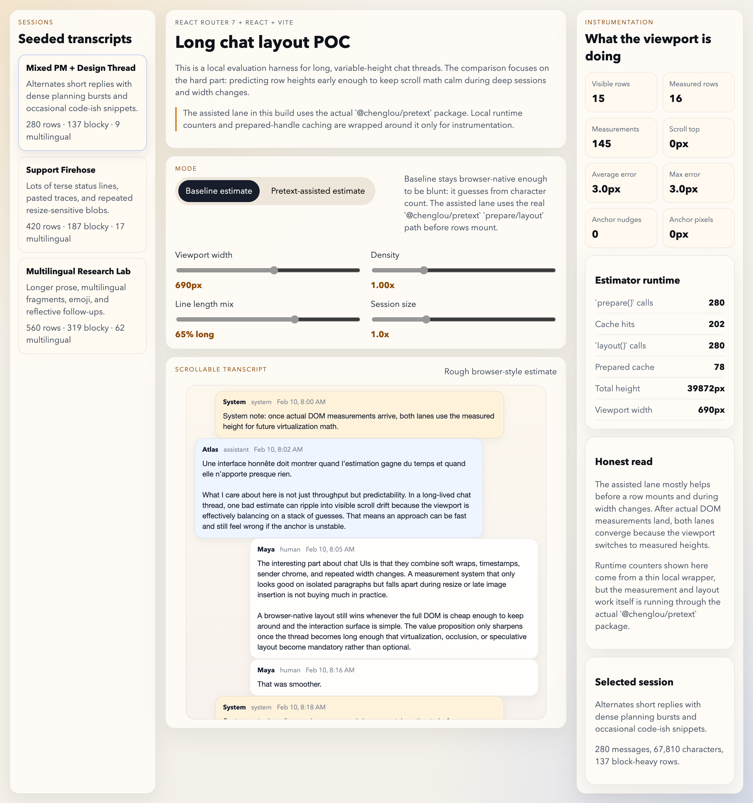

# pretext-chat-poc

Local proof of concept for evaluating the actual `@chenglou/pretext` package in a long chat interface built with React Router 7 + React + Vite.

<p align="center">
  
</p>

<p align="center"><em>Long-chat virtualization playground with Pretext-assisted measurement and live layout instrumentation.</em></p>

## Run

Install dependencies and start the Vite dev server:

```bash
npm install
npm run dev
```

Build verification:

```bash
npm run build
```

## What The POC Includes

- Session list and route-driven session switching
- Three seeded sessions with different transcript patterns
- Hundreds of rows per session and over a thousand total messages
- Mixed content: short replies, long prose, pasted code-ish text, multilingual text, emoji, timestamps, sender roles
- Baseline versus assisted measurement mode toggle
- Instrumentation for visible rows, measurement counts, estimate error, scroll position, and anchor corrections
- Stress controls for width, density, line-length mix, and session size

## Evaluation Note

### Where the assisted measurement helps

- Before rows mount, width-aware text measurement gives a better first estimate than a rough character-count heuristic.
- During width changes, a cached `prepare/layout` path gives more stable total-height math and usually needs fewer anchor corrections.
- The benefit is most visible on long prose, multilingual text, and messages with many wraps.

### Where it does not help much

- Once real DOM measurements are available, both modes converge because the viewport switches to actual heights.
- Short single-line messages do not benefit much; native browser layout is already good enough there.
- If the whole transcript can stay mounted without virtualization pressure, the browser-native lane is simpler and more faithful.

### Caveats

- This repo now uses the actual published `@chenglou/pretext` package for the assisted lane.
- The runtime stats panel wraps `prepare()` and `layout()` with a thin local counter and prepared-handle cache so the UI can show call counts and cache hits. The measurement and line-breaking behavior still comes from Pretext itself.
- Font choice matters. The app uses a named font stack instead of `system-ui` because the package docs call out `system-ui` accuracy risk on macOS.

## Notes

This is an evaluation tool, not a production chat client.

The current repo state is the public-release POC: it uses the published
`@chenglou/pretext` package, keeps local instrumentation around the measurement
calls, and exists to compare browser-native row measurement with the assisted
measurement lane under long-chat stress.

See `docs/current-state.md` for the current evaluation boundary.
